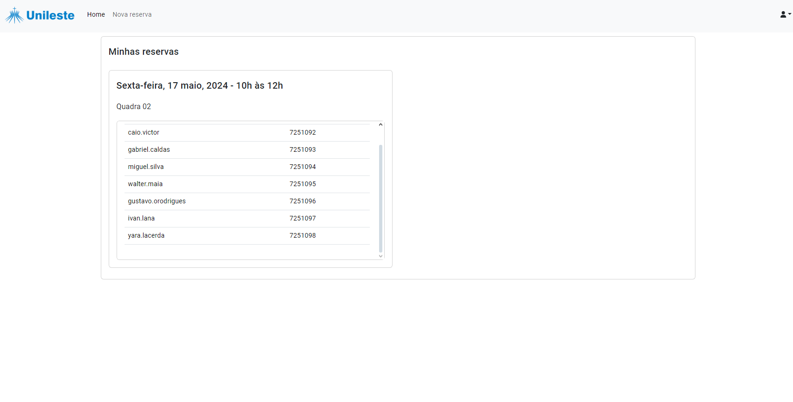

<br/>
<div align="center">

</a>
<h3 align="center">Sistema para reserva dos centros esportivos da Unileste MG</h3>
<p align="center">
Sistema WEB para reserva das quadras e campos
<br/>
<br/>
<!-- <a href="https://www.makeread.me/">View Demo .</a>   -->
<a href="https://github.com/ligeirin/reservaCentroEsportivo/issues/new?labels=bug;template=bug_report.md">Reportar bug</a>
<a href="https://github.com/ligeirin/reservaCentroEsportivo/issues/new?labels=enhancement;&template=feature_request.md">Solicitar funcionalidade</a>
  
<a href="https://github.com/ShaanCoding/makeread.me/issues/new?labels=bug&amp;template=bug_report.md">Reportar bug</a>
<a href="https://github.com/ShaanCoding/makeread.me/issues/new?labels=enhancement&amp;&template=feature_request.md">Request Feature</a>
</p>
</div>

## Sobre o projeto



Atualmente, a reserva dos centros esportivos para a Unileste MG é feita através de um formulário adquirido no site da universidade, que é preenchido pelo aluno responsável e enviado por email.

Com este sistema, os alunos podem:

- Fazer a reserva de forma online e rápida,
- Saber a disponibilidade dos centros esportivos de forma instantânea,
- Verificar as reservas feitas pelos mesmos.

### Tecnologias

Este projeto foi feito usando as seguintes tecnologias:

- [Angular](https://angular.io)
- [NodeJS](https://nodejs.org/)
- [Bootstrap](https://getbootstrap.com)

## Começando

A seguir, são instruções para baixar e rodar o projeto, incluindo Frontend e Backend.

### Pré-requisitos

- Este projeto foi criado utilizando o <a href="https://nodejs.org/en/download">NodeJS 20.13.0</a>. Certifique-se de ter a versão correta instalada para rodar o projeto.

- Após a instalação, certifique-se de que a versão correta foi instalada:
  ```sh
    node --version
  ```

  Caso a versão 20.13.0 esteja instalada, você pode clonar o projeto para seu computador.

### Installation

Siga os passos a seguir para a instalação:

1. **Clone o repositório:** Começe [instalando o Git](https://git-scm.com/downloads) e clonando o repositório para seu computador pelo CMD:

   ```
   git clone https://github.com/ligeirin/reservaCentroEsportivo
   ```

2. **Instale os packages do Frontend:** Abra um novo terminal e navegue para a pasta &quot;/frontend&quot; e instale os packages necessários usando os comandos abaixo:

   ```sh
   cd frontend
   npm install
   ```

3. **Instale os packages do Backend:** Abra um novo terminal e navegue para a pasta &quot;/backend&quot; e instale os packages necessários usando o comando no seu terminal:

   ```sh
   cd backend
   npm install
   ```

4. **Configure o banco de dados:** Rode [este script](https://github.com/ligeirin/reservaCentroEsportivo/blob/master/script_sql.txt) no MySQL Workbench para criar e popular as tabelas

5. **Configure as variaveis de ambiente:** Acesse o arquivo .env dentro da pasta backend e preencha com as variaveis a seguir:

   ```sh
   URL=localhost
   USER=root
   PASSWORD={senha do usuario root do MySQL}
   DATABASE=reservacentroesportivo
   PORT=3000
   ```

6. **Rode o Backend:** Dentro da pasta &quot;/backend&quot;, digite o seguinte comando para rodar o server Backend no seu terminal:

   ```sh
   npm run start
   ```

7. **Rode o Frontend:** Por fim, dentro da pasta &quot;/frontend&quot;, digite o seguinte comando para rodar o frontend no seu terminal:

   ```sh
   npm run start
   ```

   Agora, acesse [localhost:4200](http://localhost:4200) para acessar a aplicação!

## Funcionalidades

   - [x] Validação de disponibilidade de centro esportivo para dia e horário inseridos
   - [x] Validação de data de reserva

## Contato

Perguntas ou sugestões, entre em contato:

   - Crie um issue no GitHub: [GitHub Repository](https://github.com/ligeirin/reservaCentroEsportivo)

## Template

   Este READ.ME foi gerado usando [makeread.me](https://www.makeread.me/) 🚀
